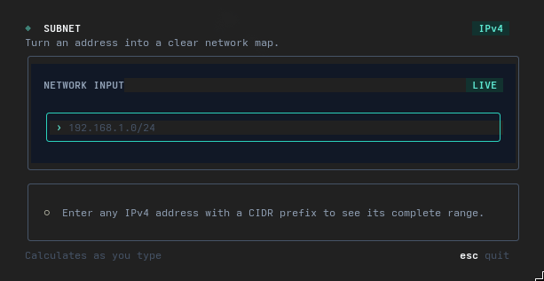
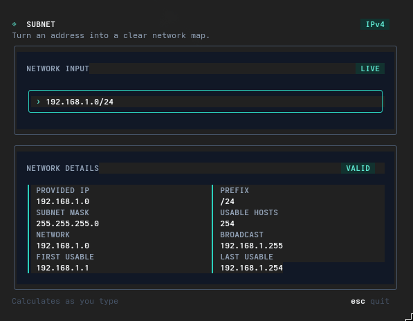

# Subnetting

A fast, interactive IPv4 subnet calculator for the terminal. Enter an address
in CIDR notation and see the network details update as you type.



## What it calculates

- Subnet mask
- Network address
- Broadcast address
- First and last usable addresses
- Number of usable hosts

## Run

Requires Go 1.26.3 or later.

```sh
go run .
```

Type an IPv4 address followed by its CIDR prefix:

```text
192.168.1.0/24
```

The calculation appears immediately:



## Controls

| Key | Action |
| --- | --- |
| Type | Enter or edit an IPv4/CIDR address |
| `Esc` | Quit |
| `Ctrl+C` | Quit |

## Build

Create and run a standalone executable:

```sh
go build -o subnetting .
./subnetting
```

Only IPv4 addresses are supported.
