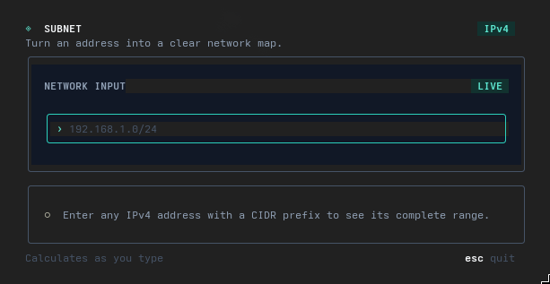
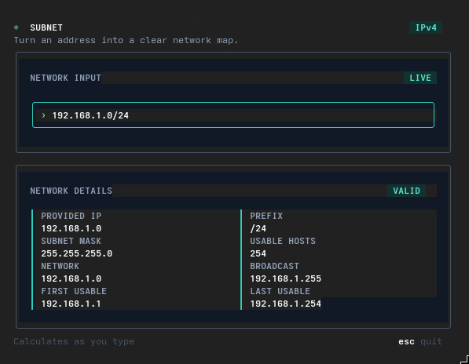

# Subnetting

A fast, interactive IPv4 subnet calculator and learning tool for the terminal.
Enter an address in CIDR notation and see the network details update as you
type. Optional panels explain the calculation without taking focus from the
calculator.



## What it calculates

- Subnet mask
- Network address
- Broadcast address
- First and last usable addresses
- Number of usable hosts
- The CIDR-to-mask calculation and containing subnet block
- The bitwise AND that produces the network address

## Run

Requires Go 1.26.3 or later.

```sh
go run ./cmd/subnetting
```

Color follows the terminal's ANSI palette, so the interface adapts to light,
dark, high-contrast, and customized terminal themes without detecting a theme
by name. The default mode enables color only when the output supports it and
respects a non-empty `NO_COLOR` environment variable:

```sh
go run ./cmd/subnetting --color=auto
go run ./cmd/subnetting --color=always
go run ./cmd/subnetting --color=never
NO_COLOR=1 go run ./cmd/subnetting
```

Type an IPv4 address followed by its CIDR prefix:

```text
192.168.1.0/24
```

The calculation appears immediately:



## Controls

| Key | Action |
| --- | --- |
| Type | Enter or edit an IPv4/CIDR address |
| `L` | Toggle the live step-by-step learning panel |
| `B` | Toggle the binary visualization panel |
| `?` | Toggle keyboard help |
| `Q` | Quit |
| `Esc` | Quit |
| `Ctrl+C` | Quit |

Panel state is kept for the duration of the session. On wide terminals the
optional panels appear beside the calculator; on narrow terminals they stack
below it.

## Build

Create and run a standalone executable:

```sh
go build -o subnetting ./cmd/subnetting
./subnetting
```

Only IPv4 addresses are supported.
